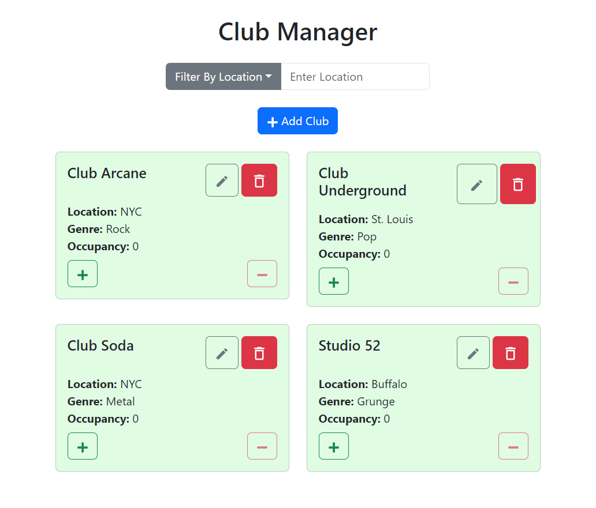
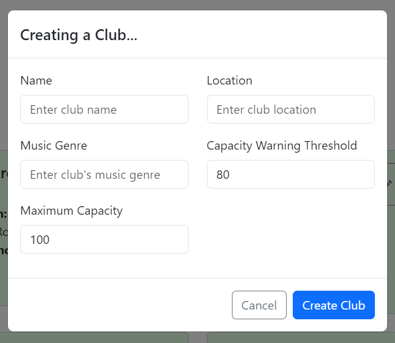
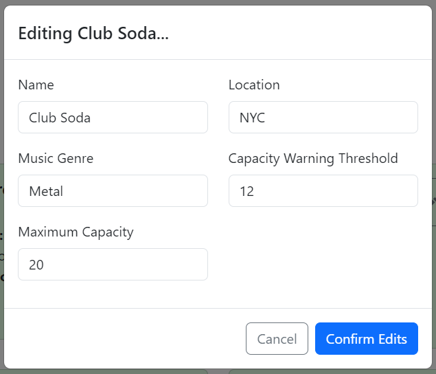
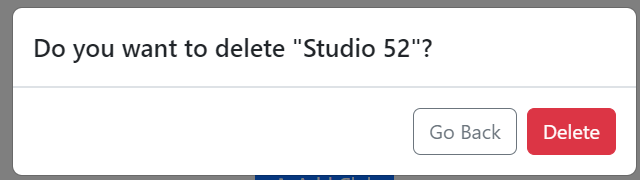

# **Club Occupancy Manager**  

A web application for managing club occupancy and performing CRUD operations on club data. This project was developed as part of the *SWEN-344 Engineering of Web-Based Software Systems* course, utilizing modern web development technologies.  

## **Features**  
- Responsive user interface built with React and Reactstrap.  
- PostgreSQL database for robust data storage and management.  
- RESTful API implemented with Python Flask for server-side logic and data manipulation.  
- Seamless integration between front-end, back-end, and database components.  

---

## **Technologies Used**  
- **Front-End**: React, Reactstrap  
- **Back-End**: Python, Flask  
- **Database**: PostgreSQL  
- **Other Tools**: RESTful APIs

---

## **Screnshots**

### **Club Management**
The home page CRUD interface for adding, editing, deleting, and viewing club details.


### **Creating a Club**
A modal for creating a new club with specified details


### **Editing a Club**
A modal for editing a club's specified detils


### **Deleting a Club**
A modal for deleting a club



---

## **Setup and Installation**  

1. **Clone the Repository**:  
   ```bash
   git clone https://github.com/alexcarron/club-occupancy-manager.git
   cd club-occupancy-manager
   ```

2. **Install Dependencies**:  
   - Navigate to the client and server directories and install dependencies:  
     ```bash
     # For the client (React)
     cd client
     npm install

     # For the server (Flask)
     cd ../server
     pip install -r requirements.txt
     ```

3. **Database Configuration**:  
   - Create a `db.yml` file in the `server/config` directory with your PostgreSQL credentials.  
   - Example `db.yml` file:  
     ```yaml
     # Configuration file for connecting to PostgreSQL
     host: localhost
     database: swen344
     user: swen344
     password: <password>
     port: 5432
     ```
   - **Note**: For security reasons, this file is `.gitignored` and not included in the repository.

4. **Run the Application**:  
   - Start the PostgreSQL server.  
   - Run the back-end server:  
     ```bash
     cd server
     python server.py
     ```  
   - Run the front-end development server:  
     ```bash
     cd client
     npm start
     ```

5. **Access the Application**:  
   Open your browser and navigate to `http://localhost:3000` to access the app.  

---

## **Acknowledgments**  
This project was created for educational purposes as part of the *SWEN-344 Engineering of Web-Based Software Systems* course at RIT.  
